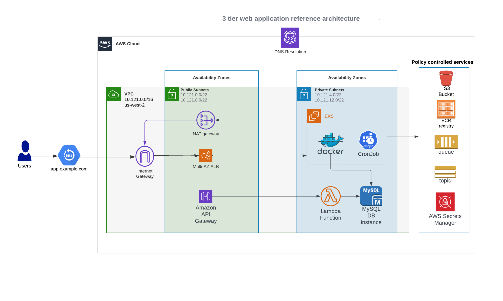
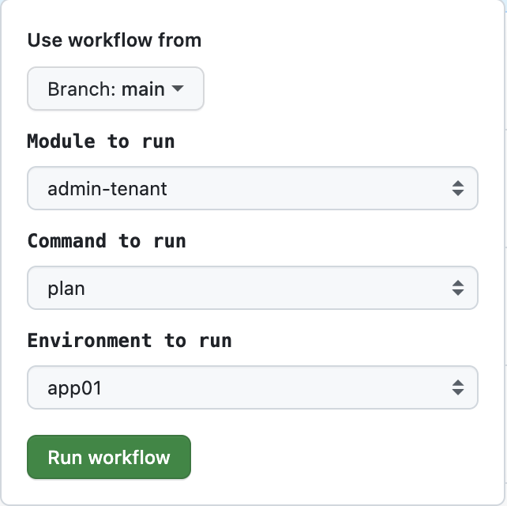

# 3 Tier Web Application AWS Reference Architecture

## Overview

This project combines a sample application, pipelines, and infrastructure as code to stand up a reference architecture leveraging the DuploCloud Platform.

## Table of Contents
- [3 Tier Web Application AWS Reference Architecture](#3-tier-web-application-aws-reference-architecture)
  - [Overview](#overview)
  - [Table of Contents](#table-of-contents)
  - [Architecture Diagram](#architecture-diagram)
  - [Components](#components)
  - [Deployment](#deployment)
    - [Assumption](#assumption)
  - [Configuration](#configuration)
  - [License](#license)

## Architecture Diagram





## Components

- Application
- Pipelines
- Infrastructure as code


## Deployment

### Assumption

- terraform version
- set github env and secrets
- duplo token has admin permission

This GitHub project is a template project.  You can create your own GitHub repository from this template.  

Create GitHub Actions secrets


- DUPLO_HOST (environment variable)
- DUPLO_TENANT_BASE (environment variable)
- DUPLO_TOKEN (secret)


Run infra pipeline for admin-tenant apply
Run infra pipeline for aws-servies apply

Run image pipelines

Run infra pipeline for app




## Configuration

To customize the infrastructure between the different environments (dev, qa, staging, production) you can create Terraform variables file under the following path:

```
iac/terraform/$project/config/$DUPLO_TENANT_BASE-$environment/$project.tfvars
```

$DUPLO_TENANT_BASE
$ENVIRONMENT
$PROJECT

An example of this has been provided in `iac/terraform/aws-services/config/app01-prod/aws-services.tfvars` to increase the size of the AutoScaling group from 1 to 2. 

## License

See LICENSE file

